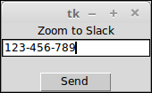
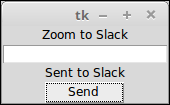

# Installation

## Requirements

* Python 3
* TKinter
* Slack client

```
apt-get install python3-tk
pip install slackclient
```

```
git clone https://github.com/jmleroux/akeneo-video-conf-bot.git
```

# Usage

```
python3 zoom2slack.py
```

Or with the executable shell launcher:

```
./run.sh
```

Screenshot before clicking the button:



Screenshot after:



### Resources:

* https://github.com/slackapi/python-slackclient
