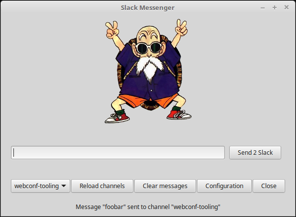

# Installation

## Requirements

System requirements:

* Python 3
* Gtk Object

```
sudo apt-get install python3-pip
sudo apt-get install python3-gi
```

Python requirements:

* Slack client

```
sudo -H pip3 install slackclient
```

Then get the project and enter it:

```
git clone https://github.com/jmleroux/akeneo-video-conf-bot.git
cd akeneo-video-conf-bot
```

# Usage

```
python3 zoom2slack.py
```

Or with the executable shell launcher:

```
./run.sh
```

## Screenshots:


Message sent:



## Demo:

[MP4 video](doc/demo.mp4)

<video src="doc/demo.mp4" width="320" height="200" controls preload></video>

### Resources:

* https://github.com/slackapi/python-slackclient
* https://developer.gnome.org/gtk3/3.22/gtk.html
